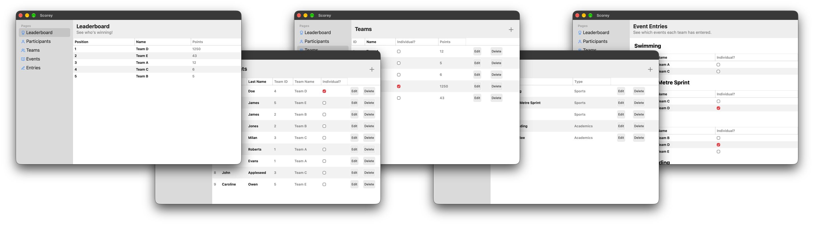
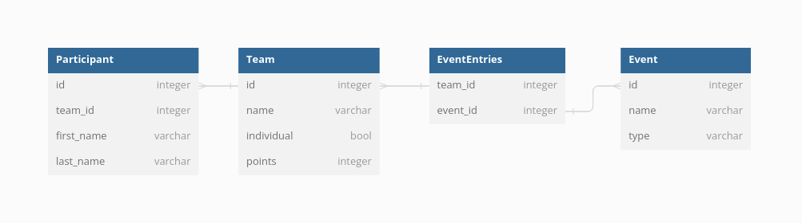
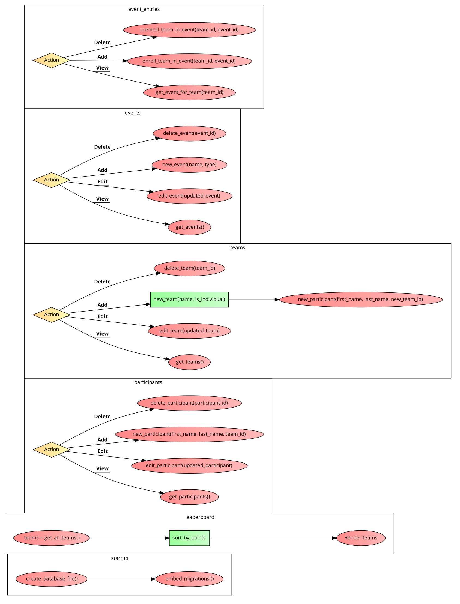

# Scorey

[Download the latest release](../../releases/latest) or [Run from Source](#running-from-source)

> Submitted for my BTEC Level 3 Information Technology course in college. This project has been archived and unmodified since submitting it. \*This is the Original branch. You can view the final submission [here](../../tree/resubmission).

Scorey is a desktop application built with Rust and Tauri 1.5.14. I was assigned to build a desktop application to track the scores of different teams in different sports. Scorey lets you add participants, teams, and events. You can link teams to events, and then give teams scores!

This was built in a Linux desktop environment, but I was heavily inspired by macOS' design at the time, and you can see it reflected in the design and layout of Scorey.

## Database Design & Project Flowchart

## Running from Source

Requires [Rust](https://rustup.rs) and [Bun](https://bun.sh). Linux also needs the Tauri system dependencies. Read [Tauri v1 prerequisites](https://tauri.app/v1/guides/getting-started/prerequisites).

1. Clone this repository
2. Run `bun install` to install dependencies
3. Run `bun tauri dev`
